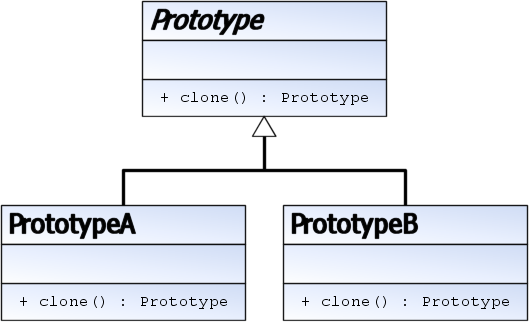

# Prototype 

## Problème

On souhaite créer une instance qui soit une copie conforme d'une autre.

Cas de figure :

* Copier une instance avec des paramètres par défaut
* On ne souhaite pas modifier l'objet, mais renvoyer une instance modifiée

## Solution

Toutes les classes dérivées implémentent une méthode "clone" renvoyant une copie conforme.

## Exemple dans l'API Java

Les exemples sont légions, l'API dispose d'une interface Cloneable.

## Mise en garde

Il convient d'être attentif aux copies des variables membres, en particulier pour les objets qui peuvent être modifiés après la construction (notion d'[Immutable Objects](http://docs.oracle.com/javase/tutorial/essential/concurrency/immutable.html)).

A titre d'exemple, sans précaution particulière, deux copies pourront pointer sur le même tableau.

## Lien(s) utile(s)

https://fr.wikibooks.org/wiki/Patrons_de_conception/Prototype

