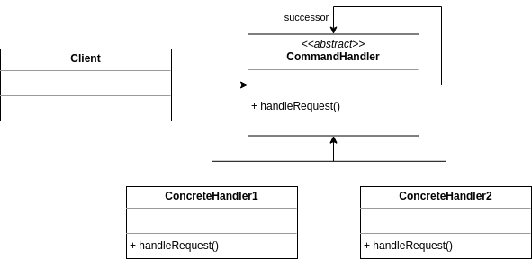
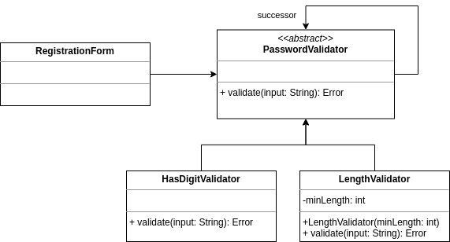

# Chain of responsibility (Chaîne de responsabilité)

## Problème

Nous avons un **traitement décomposé en une succession d'étapes**. Nous voulons structurer au mieux cet enchaînement et être en mesure de modifier dynamiquement le traitement.

## Cas d'école

Nous avons un formulaire d'inscription sur une application web. Nous devons **valider les mots de passe** avec une politique dépendant du rôle de l'utilisateur (utilisateur simple ou administrateur).

## Solution

Nous pouvons nous inspirer du patron de conception chaîne de responsabilité prenant la forme générale suivante :



Nous procéderons comme suit en prenant la **liberté d'adapter avec l'ajout d'un paramètre et d'une valeur en retour** :



A l'usage, nous pourrons mettre en oeuvre deux politiques dans `RegistrationForm` comme suit :

```java
/*
 * Création d'une politique avec peu de contraintes
 * pour les utilisateurs lambda
 */
const userPasswordValidator = new LengthValidator(8);

/*
 * Création d'une politique plus contraignante
 * pour les administrateurs
 */
const adminPasswordValidator = new LengthValidator(12);
adminPasswordValidator.setSuccessor(new HasDigitValidator());
// ...
```

## Liens utiles

* [fr.wikibooks.org - Chaîne de responsabilité](https://fr.wikibooks.org/wiki/Patrons_de_conception/Cha%C3%AEne_de_responsabilit%C3%A9)

