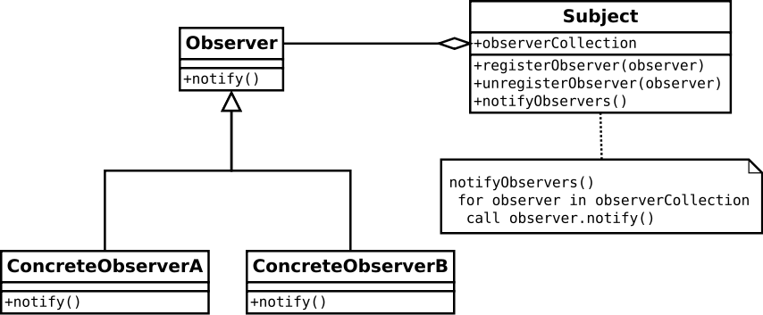

# Observer

## Problème

Nous souhaitons pouvoir réaliser des actions en cas d'événement particulier sur un objet (ex : mettre à jour une interface en cas de modification de l'état de l'objet).

## Solution

Nous pouvons procéder comme suit en ajoutant des "observateurs" qui seront notifiés en cas d'événement sur un "observable" :

Source [<https://fr.wikipedia.org/wiki/Observateur_(patron_de_conception)>](https://fr.wikipedia.org/wiki/Observateur_(patron_de_conception))

## Variantes

Ce principe est repris et adapté dans de nombreux langages et cadriciels :

* En JavaScript, avec `addEventListener` en standard sur les objets HTML et `trigger/on` avec JQuery.
* En PHP, où nous trouverons des concepts proches dans Symfony (`EventListener`, `EventSubscriber`, `EventDispatcher`)
* En C++, avec les mécanismes `signal/slot` dans Qt
* ...

## Liens utiles

* [fr.wikibooks.org - Observateur](https://fr.wikibooks.org/wiki/Patrons_de_conception/Observateur)
* [refactoring.guru - Observateur](https://refactoring.guru/fr/design-patterns/observer)
* [Design pattern Observateur en Java : positionnement via un GPS (design-patterns.fr)](http://design-patterns.fr/observateur-en-java)

