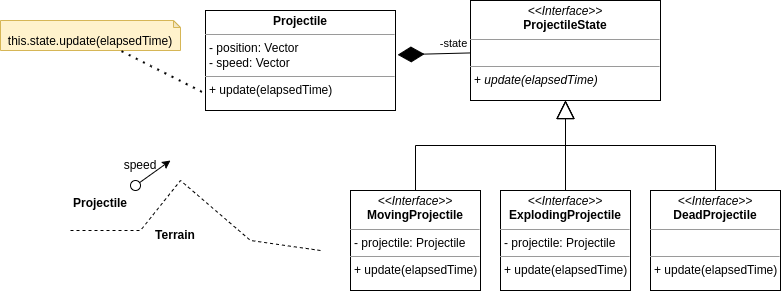

# State (État)

## Problème

Nous avons des traitements dépendant le l'état d'un objet et souhaitons externaliser la logique correspondante.

## Cas d'école

Nous avons une **simulation de particules** initialisées avec une vitesse initiale passant par trois états successifs :

* **MOVING** où la particule est mise à jour par un moteur physique
* **EXPLODING** produisant une animation quand la particule entre en collision par exemple avec le terrain
* **DEAD** quand l'animation est terminée

Nous ne voulons pas gérer toute cette logique dans une méthode `update(elapsedTime)` sur la classe `Particule`.

## Solution

Nous pouvons nous inspirer du patron état comme suit avec une classe par état :



Nous aurons un code du style suivant pour la gestion du mouvement :

```java
class MovingProjectile {
    public void update(double elapsedTime){
        // calcul du déplacement...
        // détection d'une éventuelle collision
        if ( collision != null ){
            projectile.setPosition(collision.getPosition()); 
            projectile.setSpeed(Vector.ZERO);
            // changement de l'état
            projectile.setState(new ExplodingState(projectile));
        }
    }
}
```

## Liens utiles

* [fr.wikibooks.org - État](https://fr.wikibooks.org/wiki/Patrons_de_conception/%C3%89tat)
* [refactoring.guru - État](https://refactoring.guru/fr/design-patterns/state)
