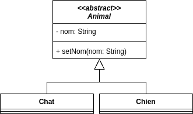
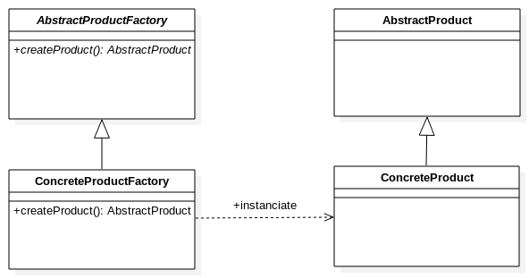

# Factory (Fabrique)

## Problème

La fabrique classique s'adresse à la problématique de la création d'instances dérivées d'une classe. Nous verrons qu'elle admet plusieurs variantes.

## Cas d'école

Nous avons par exemple la hiérarchie suivante :



Supposons que nous devons créer des instances de la classe Animal dans plusieurs parties de l'application (chargement à partir d'un fichier CSV, chargement à partir d'une requête sur une API,...)

A chaque fois, nous devrons faire appel à "new" en fonction du type de l'animal :

```ts
let animal: Animal = null ;
if ( typeAnimal == "chat" ){
    animal = new Chat() ;
}else if (typeAnimal == "chien"){
    ranimal = new Chien() ;
}else{
    throw new AnimalTypeNotFound(typeAnimal);
}
animal.setNom(nomAnimal);
```

**En cas d'ajout d'un type d'animal, nous devrons modifier tous les codes créant des animaux.**


## Solution

Nous pouvons définir une **classe avec une méthode dédiée à la création des instances** en fonction d'un type :


Le **code gérant la logique de création en fonction du type sera localisé dans cette fabrique** :

```ts
class FabriqueAnimal {
    public createAnimal(typeAnimal: string): Animal {
        if ( typeAnimal == "chat" ){
            return new Chat() ;
        }else if (typeAnimal == "chien"){
            return new Chien() ;
        }else{
            throw new AnimalTypeNotFound(typeAnimal);
        }
    }
}
```

Il sera alors **possible d'ajouter un type sans modifier les codes faisant appel à cette fabrique** :

```ts
const animal = animalFactory.createAnimal(typeAnimal) ;
animal.setNom(nomAnimal);
```

## Variantes

Nous trouverons de nombreuses variantes du concept de fabrique :

* La **fabrique statique**

```java
AnimalFactory.createByType("chien")
```

* Les fabriques basées sur des [prototypes](Prototype.md) (composition de pattern) travaillant par copie de modèle d'instance.

* Les **fabriques utilitaires** qui ne créent pas des instances de types différents, mais avec des états initiaux différents :

```java
FractalFactory.createSierpinskiTriangles(8);
```

* **Factory Method** où **le choix de la fabrique déterminera le type créé** :



* **Abstract Factory** où **le choix de la fabrique déterminera la famille des objets créés** (cas d'école : plusieurs implémentations pour des classes géométriques) :


## Liens utiles

* [fr.wikibooks.org - Fabrique](https://fr.wikibooks.org/wiki/Patrons_de_conception/Fabrique)
* [fr.wikibooks.org - Fabrique abstraite - exemple avec des widgets d'interface WIN32 et OSX](https://fr.wikibooks.org/wiki/Patrons_de_conception/Fabrique_abstraite)
* [refactoring.guru - Fabrique abstraite](https://refactoring.guru/fr/design-patterns/abstract-factory)
* [stackoverflow.com - Factory vs Factory method vs Abstract Factory](https://stackoverflow.com/questions/13029261/design-patterns-factory-vs-factory-method-vs-abstract-factory)

