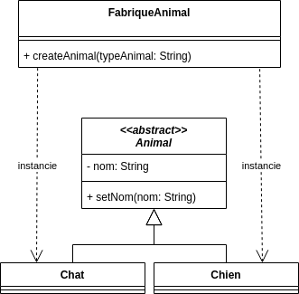
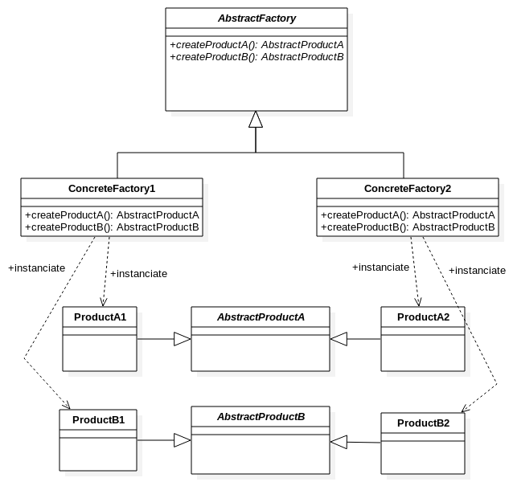

# Factory (Fabrique)

## Problème

La fabrique classique s'adresse à la problématique de la création d'instances dérivées d'une classe. Nous verrons qu'elle admet plusieurs variantes. 

## Cas d'école

Nous avons par exemple la hiérarchie suivante :


Supposons que nous devons charger un fichier contenant des animaux et créer des animaux via une API WEB.

A chaque fois, nous devrons faire appel à "new" en fonction du type de l'animal :

```java
Animal animal = null ;
if ( typeAnimal.equals("chat") ){
    animal = new Chat() ;
}else if (typeAnimal.equals("chien")){
    animal = new Chien() ;
}else{
    throw new AnimalTypeNotFound(typeAnimal);
}
animal.setNom(nomAnimal);
```

**En cas d'ajout d'un type d'animal, nous devrons modifier tous les codes créant des animaux.**


## Solution

Nous pouvons définir une **classe avec une méthode dédiée à la création des instances** en fonction d'un type :



Le **code gérant la logique de création sera localisé dans cette fabrique** :

```java
class FabriqueAnimal {
    public Animal createAnimal(String typeAnimal){
        if ( typeAnimal.equals("chat") ){
            return new Chat() ;
        }else if (typeAnimal.equals("chien")){
            return new Chien() ;
        }else{
            throw new AnimalTypeNotFound(typeAnimal);
        }
    }
}
```

Il sera alors **possible d'ajouter un type sans modifier les codes faisant appel à cette fabrique** :

```java
Animal animal = animalFactory.createAnimal(typeAnimal) ;
animal.setNom(nomAnimal);
```

## Variantes

Nous trouverons de nombreuses variantes du concept de fabrique :

* La **fabrique statique**

```java
AnimalFactory.createByType("chien")
```

* Les fabriques basées sur des [prototypes](Prototype.md) (composition de pattern) :

```java
class AnimalFactory throws AnimalTypeNotFound {
    private Map<String, Animal> prototypes = new HashMap<>();

    public Animal createAnimal(String typeAnimal){
        Animal prototype = prototypes.get(typeName);
        if ( prototype == null ){
            throw new AnimalTypeNotFound(typeAnimal);
        }
        return prototype.clone();
    }
}
```

* Les **fabriques utilitaires** qui ne créent pas des instances de types différents, mais avec des états initiaux différents :

```java
FractalFactory.createSierpinskiTriangles(8);
```

* **Factory Method** où **le choix de la fabrique déterminera le type créé** :


* **Abstract Factory** où **le choix de la fabrique déterminera la famille des objets créés** (cas d'école : plusieurs implémentations pour des classes géométriques) :




## Exemple en Java

Les fabriques sont nombreuses dans l'API java et dans les bibliothèques :

* [GeometryFactory de JTS](https://locationtech.github.io/jts/javadoc/org/locationtech/jts/geom/GeometryFactory.html) pour la création de géométrie de différents types (Point, LineString, Polygon, etc.)
* [java.sql.DriverManager](https://docs.oracle.com/javase/8/docs/api/java/sql/DriverManager.html) où nous trouvons une fabrique statique :

```java
Connection connection = DriverManager.getConnection("jdbc:postgresql:mabase")
```

## Liens utiles

* [fr.wikibooks.org - Fabrique](https://fr.wikibooks.org/wiki/Patrons_de_conception/Fabrique)
* [fr.wikibooks.org - Fabrique abstraite - exemple avec des widgets d'interface WIN32 et OSX](https://fr.wikibooks.org/wiki/Patrons_de_conception/Fabrique_abstraite)
* [refactoring.guru - Fabrique abstraite](https://refactoring.guru/fr/design-patterns/abstract-factory)
* [stackoverflow.com - Factory vs Factory method vs Abstract Factory](https://stackoverflow.com/questions/13029261/design-patterns-factory-vs-factory-method-vs-abstract-factory)

