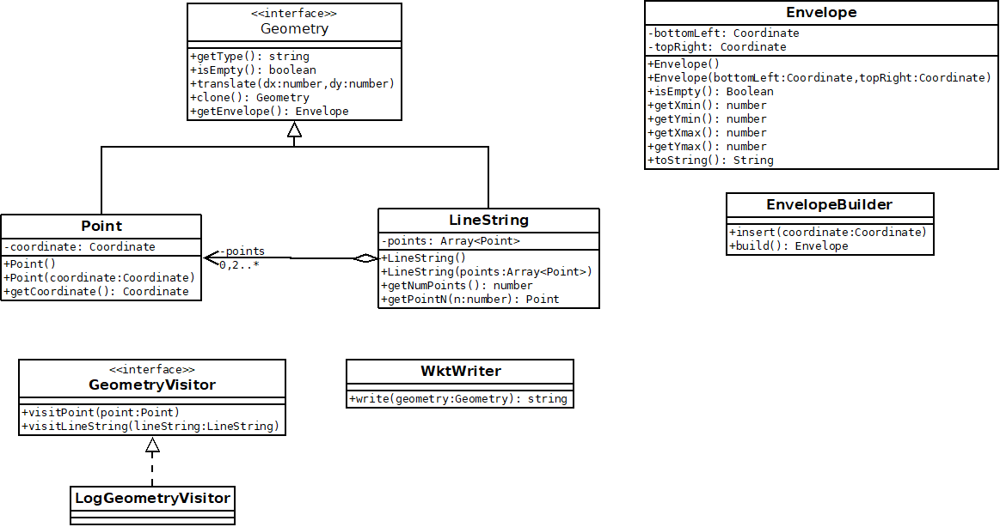
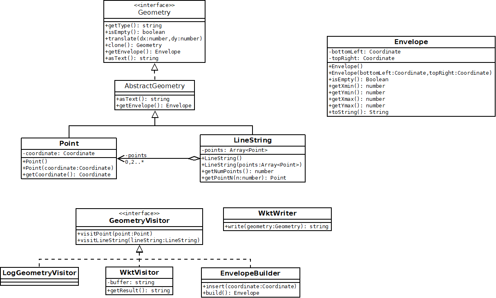

# TP - Mise en oeuvre des patrons de conception avec des classes géométriques

[[toc]]

## Introduction

L'objectif de ce TP est de s'exercer à mettre en oeuvre des patrons de conception via la création d'une petite bibliothèque de manipulation des géométries OGC :


Vous noterez toutefois que **ceci n'est qu'un exercice** :

* **Nous allons réinventer la roue carrée** (utilisez plutôt [JSTS](https://github.com/bjornharrtell/jsts?tab=readme-ov-file#jsts) et [Turf.js](https://turfjs.org/) dans la vraie vie).
* **Nous allons sombrer dans la paternite** (les patrons de conception ne seront pas la solution à tous les problèmes et nous n'en n'utiliserons pas autant)

## Démarrage

* Forker le projet https://github.com/mborne/tp-geometry-ts
* Cloner le fork
* Lire le fichier [README](https://github.com/mborne/tp-pattern-geometry#tp-pattern-geometry)
* Exécutez les tests et afficher le rapport de couverture.

## Mise en garde

Vous devrez impérativement :

* **Livrer un code fonctionnel et testé sur la <u>branche par défaut</u> de votre fork**
* **Avoir au moins un commit (voire une branche) par question avec un commentaire d'identifier la question** (ex `0.1 - ajout de l'interface Geometry et des classes Point et LineString`)

Pour ce faire, il vous est vivement conseillé de :

* Lancer les tests automatiques (`npm run test`) à chaque étape.
* Travailler avec une branche "dev" si vous voulez pousser des résultats non finalisés.

---

## 0.1 - Geometry, Point et LineString

> Objectif : Préparation du TP, utilisation d'interface, encapsulation

Implémenter les trois classes suivantes illustrées sur le schémas ci-après :


Remarques :

* `getType()` renverra le nom de la classe en *CamelCase* (`"Point"` ou `"LineString"`)
* Nous nous interdirons de modifier ce comportement dans les questions suivantes (~~`"POINT"`~~, ~~`"LINESTRING"`~~).


## 0.2 - Geometry.isEmpty()

> Objectif : Bonne pratique *NonNullObject*

Afin d'éviter d'avoir à tester des `coordinates` ou `points` `null` ou `undefined`, nous allons ajouter le **concept de géométrie vide** :

* S'assurer que la variable membre `points` de `LineString` n'est jamais nulle (une liste vide est préférable à une valeur nulle).
* S'assurer que la variable membre `coordinate` de `Point` n'est jamais nulle (utiliser `[]` et adapter `x()` et `y()`)
* Déclarer `Geometry.isEmpty` et l'implémenter dans `Point` et `LineString`


Remarque : Nous ne traiterons pas le cas d'un appel `new LineString(points)` avec un point null.

## 0.3 - Geometry.translate(dx,dy)

> Objectif : Exploiter une interface pour réaliser un traitement spécifique

Ajouter une méthode de permettant de translater une géométrie.


## 0.4 - Geometry.clone()

> Objectif : Patron de conception *Prototype*

En introduisant la fonction précédente, nous avons renoncé à l'idée d'avoir des géométries immuable (non modifiable après construction).

Nous allons donc ajouter une méthode `clone()` permettant de récupérer une copie d'une géométrie :


Exemple d'utilisation :

```ts
const copy = g.clone();
copy.translate(10.0,10.0);
//... "g" n'est pas modifiée
```

Remarques :

* Sans `clone()`, un traitement particulier serait nécessaire pour copier un `Point`, une `LineString`, etc.
* Nous procéderons à une **copie en profondeur** pour les seules propriétés non immuables.


## 0.5 - Envelope et EnvelopeBuilder

> Objectif : Patron de conception Builder

Nous souhaitons calculer l'emprise d'une géométrie (la bbox). La logique de calcul de min/max en oeuvre étant assez complexe, nous ne souhaitons pas l'implémenter dans les classes `Point` et `LineString`.

Nous allons donc procéder comme suit :

* Ajouter une classe `Envelope` représentant une emprise rectangulaire.
* Ajouter une classe utilitaire `EnvelopeBuilder` qui aura pour rôle de construire cette emprise.


Exemple d'utilisation :

```ts
const builder = new EnvelopeBuilder();
builder.insert([0.0,1.0]);
builder.insert([2.0,0.0]);
builder.insert([1.0,3.0]);
// récupération du résultat
const result = builder.build();
```

Remarques : 

* Vous avez la **liberté d'ajouter des variables membres privées** dans `EnvelopeBuilder` pour le calcul.
* En cas de difficulté pour faire des calculs de min/max optimaux, vous pouvez par exemple vous appuyer sur deux variables privées `xVals` et `yVals` pour exploiter les fonctionnalités standards `Math.min` et `Math.max` (cette approche ne sera pas "optimale", mais elle peut être un premier jet permettant la mise en oeuvre des tests avant optimisation).

## 0.6 - Geometry.getEnvelope() : Envelope

> Objectif : Facade sur EnvelopeBuilder

Ajouter une méthode utilitaire sur `Geometry` pour récupérer facilement l'enveloppe comme suit :

* Déclarer une méthode `getEnvelope` dans `Geometry`
* Implémenter cette méthode dans `Point` et `LineString` à l'aide de `EnvelopeBuilder`


## 0.7 - WktWriter

> Objectif : Mesurer l'intérêt d'une conception propre et de GeometryVisitor dans les questions suivantes

Ajouter une classe `WktWriter` avec une méthode permettant de convertir une géométrie au [format WKT](https://fr.wikipedia.org/wiki/Well-known_text) qui prendra par exemple les formes suivantes :

```
POINT EMPTY
POINT(3.0 4.0)
LINESTRING EMPTY
LINESTRING(0.0 0.0,1.0 1.0,5.0 5.0)
```


Exemple d'utilisation :

```ts
const g = new Point([3.0,4.0]);
const writer = new WktWriter();
// "POINT(3.0 4.0)"
const wkt = writer.write(g);
```

Remarques :

* Nous ne modifierons pas les classes `Geometry`, `Point` et `LineString` pour mettre en oeuvre cette fonctionnalité.
* Nous utiliserons un fragment de code du style suivant pour traiter les différents types concrets :

```ts
if ( geometry instanceof Point ){
    // traiter le cas Point
}else if ( geometry instanceof LineString ){
    // traiter le cas LineString
}else{
    throw new TypeError("geometry type not supported");
}
```

## 0.8 - GeometryVisitor

> Objectif : Patron de conception Visitor, prise en main

* Ajouter l'interface `GeometryVisitor`
* Implémenter un visiteur `LogGeometryVisitor` qui affiche la géométrie dans la console sous les formes suivantes :
    * "Je suis un point vide."
    * "Je suis un point avec x=2.0 et y=3.0."
    * "Je suis une polyligne vide."
    * "Je suis une polyligne définie par 3 point(s)."



Exemple d'utilisation :

```ts
const visitor = new LogGeometryVisitor();
const geometry = new Point([3.0,4.0]);
geometry.accept(visitor);
```

Remarque : pour les tests, vous pourrez remplacer temporairement `console.log` par une fonction vous permettant de capturer le résultat.


## 0.9 - WktVisitor

> Objectif : Patron de conception Visitor, mise en oeuvre dans un cas concret

Reprendre l'implémentation de WktWriter sous la forme d'un GeometryVisitor en implémentant une classe `WktVisitor`.


Exemple d'utilisation :

```ts
const visitor = new WktVisitor();
const geometry = new Point([3.0,4.0]);
geometry.accept(visitor);
// "POINT(3.0 4.0)"
const wkt = visitor.getResult();
```


## 0.10 - Geometry.asText()

> Objectif : Patron de conception Facade, héritage à trois niveau avec interface et abstract.

A l'aide de `AbstractGeometry` et `WktVisitor` :

* Ajouter une méthode `Geometry.asText(): String` renvoyant la géométrie au format WKT
* Ajouter une classe astraite `AbstractGeometry` implémentant la méthode `asText`


## 0.11 - EnvelopeBuilder en tant que GeometryVisitor

> Objectif : Visitor, refactoring (extraction de l'implémentation d'une fonctionnalité)

* Transformer `EnvelopeBuilder` en `GeometryVisitor`
* Remonter l'implémentation de `getEnvelope` dans `AbstractGeometry`




## 0.12 - GeometryWithCachedEnvelope

> Objectif : Patron de conception Decorator

* Implémenter une classe `GeometryWithCachedEnvelope` qui permet de mettre en cache le calcul de l'enveloppe


Exemple d'utilisation :

```ts
const g = new Point([3.0,3.0]);
// décoration
g = new GeometryWithCachedEnvelope(g);
const a = g.getEnvelope() ; // calcul et stockage dans cachedEnvelope
const b = g.getEnvelope() ; // renvoi de cachedEnvelope
// a et b sont la même instance
```

Remarque : Nous invaliderons ce cache dans `translate(dx,dy)`.


## 0.13 - GeometryCollection

> Objectif : Patron de conception Composite, Refactoring

Ajouter une classe `GeometryCollection` représentant une géométrie multiple, adapter les autres fonctionnalités.


Remarque : Le format WKT prendra la forme suivante pour les `GeometryCollection` :

```
GEOMETRYCOLLECTION EMPTY
GEOMETRYCOLLECTION(POINT(3.0 4.0),LINESTRING(0.0 0.0,1.0 1.0,5.0 5.0))
```

## 0.14 - GeometryVisitor renvoyant un résultat

> Objectif : Exploiter les [classes génériques](https://www.typescriptlang.org/docs/handbook/2/generics.html#generic-classes), adapter le patron visiteur au contexte.

Pour avoir la capacité de renvoyer des résultats avec des types variables :

* Transformer la classe `GeometryVisitor` en `GeometryVisitor<T>`.
* Adapter les visiteurs existants ne renvoyant pas de résultat en implémentant `GeometryVisitor<void>`.
* Ajouter une classe `LengthVisitor<number>` renvoyant la longueur de la géométrie en guise de démonstration (0.0 pour un point)

```ts
const visitor = new LengthVisitor();
const result = geometry.accept(visitor);
```
