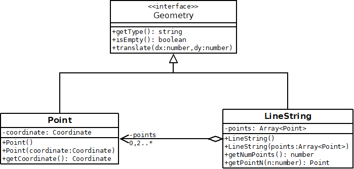
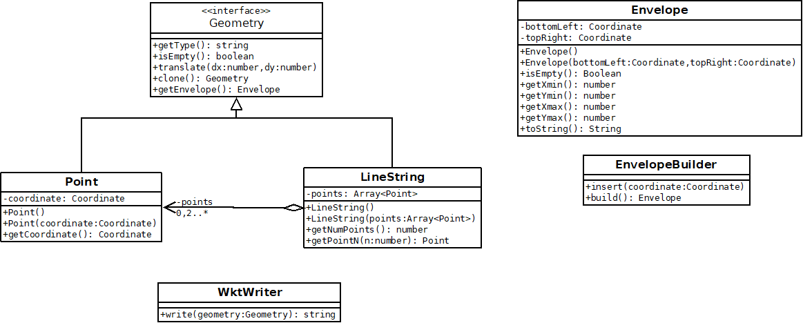

# TP - Mise en oeuvre des patterns sur des Geometry

[[toc]]

## Introduction

L'objectif de ce TP est de s'exercer à mettre oeuvre des patrons de conception via la création d'une petite bibliothèque de manipulation des géométries OGC :


**ATTENTION** : Dans la vraie vie, vous utiliserez plutôt des bibliothèques du type [JTS](https://locationtech.github.io/jts/javadoc/index.html)

## Démarrage

* Cloner le projet https://github.com/mborne/tp-pattern-geometry

```bash
mkdir ~/workspace_pattern
cd ~/workspace_pattern
git clone https://github.com/mborne/tp-pattern-geometry.git
cd tp-pattern-geometry
# vérifier que vous êtes bien sur la branche "initial"
git branch
```

* Importer le projet maven dans eclipse

(Au cas où, voir [Configuration eclipse/maven avec un proxy](https://github.com/mborne/maven-eclipse#configuration-eclipsemaven-avec-un-proxy))


## 0.1 - Coordinate (2D)

> Objectif : Préparation du TP, principe de base, encapsulation

Création d'une classe Coordinate permettant de représenter une position en 2D à l'aide d'un couple x,y.


Remarques :

* On initialisera dans un premier temps les coordonnées à `(0.0, 0.0)` dans le constructeur par défaut
* On soulignera le caractère immuable de cette classe (une fois construite, une coordonnées ne peut être modifiée)


## 0.2 - Geometry, Point et LineString

> Objectif : Préparation du TP, utilisation d'interface, encapsulation

Implémenter les trois classes suivantes illustrées sur le schémas ci-après :


## 0.3 - Geometry.isEmpty()

> Objectif : Bonne pratique *NonNullObject*

Dans la question précédente, nous remarquons que nous avons des choix à faire dans les constructeurs par défaut de `Point` et `LineString`.

Afin d'éviter d'avoir à tester des `coordinate` ou `points` null, nous allons ajouter le concept de géométrie vide et de coordonnées vide à l'aide de `NaN` :

* 1) Modifier le comportement du constructeur par défaut de Coordinate pour initialiser `x` et `y` à `Double.NaN`
* 2) Ajouter une méthode `Coordinate.isEmpty` à l'aide de `Double.isNaN(x)`
* 3) S'assurer que la variable membre coordinate de `Point` est jamais nulle.
* 4) S'assurer que la variable membre coordinate de `LineString` est jamais nulle (liste vide).
* 5) Ajouter `Geometry.isEmpty`




## 0.4 - Geometry.translate(dx,dy)

> Objectif : Exploiter une interface pour réaliser un traitement spécifique

Ajouter une méthode de permettant de translater une géométrie.


## 0.5 - Geometry.clone()

> Objectif : Patron de conception *Prototype*

En introduisant la fonction précédente, nous avons renoncé à l'idée d'avoir des géométries non modifiable après construction (immutable). Nous allons donc ajouter une méthode permettant de récupérer une copie d'une géométrie.

Ceci permettra par exemple à un utilisateur de copier la géométrie avant de la modifier

```java
/*
 * copie sans connaissance du type réel
 * (sans cela, on devrait faire un traitement particulier pour Point,
 *  LineString, etc.)
 */
Geometry copy = g.clone();
copy.translate(10.0,10.0);
//... "g" n'est pas modifiée
```


## 0.6 - Envelope et EnvelopeBuilder

> Objectif : Patron de conception Builder

Nous souhaitons calculer l'emprise d'une géométrie (la bbox). La logique de calcul de min/max en oeuvre étant assez complexe, nous ne souhaitons pas l'implémenter dans les classes `Point` et `LineString`.

Nous allons donc procéder comme suit :

* Ajouter une classe `Envelope` représentant une emprise rectangulaire de la géométrie
* Ajouter une classe utilitaire `EnvelopeBuilder` qui aura pour rôle de construire cette emprise


Exemple d'utilisation :

```java
EnvelopeBuilder builder = new EnvelopeBuilder();
builder.insert(new Coordinate(0.0,1.0));
builder.insert(new Coordinate(2.0,0.0));
builder.insert(new Coordinate(1.0,3.0));
Envelope result = builder.build();
```

## 0.7 - Geometry.getEnvelope() : Envelope

> Objectif : Facade sur EnvelopeBuilder

Ajouter une méthode `getEnvelope` à la classe `Geometry`.



## 0.8 - WktWriter

> Objectif : Mesurer l'intérêt d'une conception propre et de GeometryVisitor dans les questions suivantes

On souhaite obtenir les géométries au [format WKT](https://fr.wikipedia.org/wiki/Well-known_text) qui prendra par exemple les formes suivantes :

```
POINT EMPTY
POINT(3.0 4.0)
LINESTRING EMPTY
LINESTRING(0.0 0.0,1.0 1.0,5.0 5.0)
```

Ajouter une classe `WktWriter` avec une méthode permettant de convertir une géométrie en WKT.


Exemple d'utilisation :

```java
Geometry g = new Point(new Coordinate(3.0,4.0));
WktWriter writer = new WktWriter();
assertEquals("POINT(3.0 4.0)", writer.write(g));
```

Remarque :

* On s'interdira de modifier les classes `Geometry`, `Point` et `LineString` pour mettre en oeuvre cette fonctionnalité
* On s'autorisera l'utilisation d'un fragment de code ressemblant à ceci pour traiter les différents types concrets :

```java
if ( geometry instanceof Point ){
    Point point = (Point)geometry;
    // traiter le cas Point
}else if ( geometry instanceof LineString ){
    LineString lineString = (LineString)geometry;
    // traiter le cas LineString
}else{
    throw new RuntimeException("geometry type not supported");
}
```

## 0.9 - GeometryVisitor

> Objectif : Patron de conception Visitor, prise en main

* Implémenter `GeometryVisitor` pour visiter l'arborescence des géométries
* Implémenter un visiteur `LogGeometryVisitor` qui affiche la géométrie dans la console sous les formes suivantes :
    * Je suis un point avec x=2.0 et y=3.0
    * Je suis une polyligne définie par 3 point(s)


Exemple d'utilisation :

```java
LogGeometryVisitor visitor = new LogGeometryVisitor();
Geometry geometry = new Point(new Coordinate(3.0,4.0));
geometry.accept(visitor);
```

## 0.10 - WktVisitor

> Objectif : Patron de conception Visitor, mise en oeuvre dans un cas concret

Reprendre l'implémentation de WktWriter sous la forme d'un GeometryVisitor en implémentant une classe `WktVisitor`.


Exemple d'utilisation :

```java
WktVisitor visitor = new WktVisitor();
Geometry geometry = new Point(new Coordinate(3.0,4.0));
geometry.accept(visitor);
assertEquals( "POINT(3.0 4.0)", visitor.getResult() );
```

## 0.11 - Geometry.asText()

> Objectif : Patron de conception Facade, couplage interface et abstact

A l'aide de `AbstractGeometry` et `WktVisitor` :

* Ajouter une méthode `Geometry.asText(): String` renvoyant la géométrie au format WKT
* Ajouter une classe astraite `AbstractGeometry` implémentant la méthode `asText`


## 0.12 - EnvelopeBuilder en tant que GeometryVisitor

> Objectif : Refactoring, Visitor, extraction de l'implémentation d'une fonctionnalité

* Transformer `EnvelopeBuilder` en `GeometryVisitor`
* Remonter l'implémentation de `getEnvelope` dans `AbstractGeometry`


## 0.13 - GeometryWithCachedEnvelope

> Objectif : Patron de conception Decorator

* Implémenter une classe `GeometryWithCachedEnvelope` qui permet de mettre en cache le calcul de l'enveloppe


Exemple d'utilisation :

```java
Geometry g = new Point(new Coordinate(3.0,3.0));
// décoration
g = new GeometryWithCachedEnvelope(g);
Envelope a = g.getEnvelope() ; // calcul et stockage dans cachedEnvelope
Envelope b = g.getEnvelope() ; // renvoi de cachedEnvelope
assertSame(a,b);
```

Remarque : on traitera l'invalidation du cache en cas de modification de la géométrie originale à la prochaine question.

## 0.14 - GeometryListener

> Objectif : Patron de conception Observable

Pour être en mesure d'invalider l'enveloppe précalculée en cas de modification d'une géométrie, nous allons mettre en place un mécanisme d'événement :


* Ajouter une interface `GeometryListener` qui permettra aux utilisateurs d'être notifié en cas de modification d'une géométrie
* Notifier une modification aux `listeners` dans `translate(dx,dy)` à l'aide de `triggerChange`
* Exploiter ce mécanisme pour recalculer l'enveloppe en cas de modification dans `GeometryWithCachedEnvelope` qui s'ajoutera comme un `listener`


Remarque : `translate` étant la seule fonction capable de modifier une géométrie, il serait actuellement possible de se contenter d'invalider l'enveloppe en surchargeant `translate` dans `GeometryWithCachedEnvelope` pour nettoyer au passage le cache. Rien ne garanti toutefois que `translate` reste la seule fonction à même de modifier une géométrie et que toutes ces fonctions restent déclarées au niveau `Geometry`.


## 0.15 - GeometryCollection

> Objectif : Patron de conception Composite, Refactoring

Ajouter une classe `GeometryCollection` représentant une géométrie multiple, adapter les autres fonctionnalitées.


Remarque : Pour WKT, on utilisera le format suivant :

```
GEOMETRYCOLLECTION EMPTY
GEOMETRYCOLLECTION(POINT(3.0 4.0),LINESTRING(0.0 0.0,1.0 1.0,5.0 5.0))
```

## 0.16 - Interface GeometryWriter, classe WktWriter et GeoJSONWriter

> Objectif : Préparation question suivante

* Ajouter une classe `GeoJSONWriter` permettant d'écrire les géométries au format GeoJSON.
* Unifier l'écriture des géométries via une interface `GeometryWriter` implémentée `WktWriter` et `GeoJSONWriter` par offrant les méthodes
  * `getName` : renvoyant le nom du format ("WKT" ou "GeoJSON")
  * `write` : convertissant une géométrie au format texte


## 0.17 - GeometryWriterFactory

> Objectif : Fabrique basée sur des prototypes, supporté un format en paramètre

* Ajouter une classe `GeometryWriter` permettant de construire un format par son nom

```java
Geometry g = new Point(new Coordinate(3.0,4.0));
GeometryWriterFactory writerFactory = new GeometryWriterFactory();
GeometryWriter writer = writerFactory.createGeometryWriter("WKT");
assertEqual("POINT(3.0 4.0)", writer.write(g));
```

## 0.18 - GeometryVisitor renvoyant un résultat

* Transformer la classe `GeometryVisitor` en `GeometryVisitor<T>` pour avoir la capacité de renvoyer des résultats avec des types variables
* Ajouter `LengthVisitor<Double>` renvoyant la longueur de la géométrie en guise de démonstration (0.0 pour un point)

```java
LengthVisitor<Double> visitor = new LengthVisitor<Double>();
Double result = geometry.accept(visitor);
```

Remarque : Un visiteur qui ne renvoie pas de résultat implémentera `GeometryVisitor<Void>`


## 0.19 - Extraction de asText()

Sortir `Geometry.asText() : String` sous forme d'une méthode statique `WKT.asText(Geometry g) : String`

## 0.20 - MathTransform pour des transformation plus générique

On va faire en sorte de sortir `translate(dx,dy)` de la classe `Geometry` tout en permettant des transformations plus riches.


Remarque : On renverra des copies des géométries dans `GeometryTransform` (appeler `notifyChange` sera innutile)

## 0.21 - Finaliser une version potable

* Remarquer que la suppression de translate sur `Geometry` permet de les rendre immuable
* Supprimer par conséquent les mécanismes d'événement sur les géométries (c'est généralement une mauvaise idée sur des classes bas niveau)
* Organiser les classes en package `model`, `io`, `transform`, `helper`, etc.
* Améliorer la couverture des tests

## Aller plus loin...

Idées pour la suite :

* Implémenter une classe `GeoJSONReader`
* Implémenter une classe `WktReader`
* Poser une interface `GeometryReader` au dessus de `GeoJSONReader` et `WktReader`

* Ajouter une interface `Renderer` avec deux implémentations concrète `JFrameRenderer` et `SVGRenderer`
* Gérer un `center` et un `scale` sur `Renderer`
* Viewer avec Renderer définissant une stratégie

Questions pour approfondir :

* Peut-on permettre l'ajout d'un type de premier niveau tel `Circle` dans une bibliothèque tierce utilisant celle-ci? Qu'est-ce qui est limitant?

