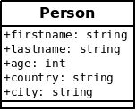
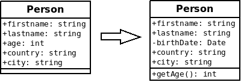
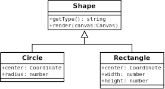

# Méditation

Quelques exemples à méditer pour bien **comprendre l'intérêt
des différents concepts de la P.O.O.**

* Intérêt des classes et des attributs
* Intérêt des constructeurs
* Intérêt de l'encapsulation
* Mise en garde sur encapsulation
* Intérêt du polymorphisme
* Intérêt des interfaces
* Mise en garde sur les interface
* Intérêt des classes abstraites

---

## Intérêt des classes et des attributs (1/2)

Pour comprendre l'**intérêt des classes et des attributs**, il faut d'abord comprendre l'intérêt de la possibilité de définir un type utilisateur (ex : `struct` en C).

Prenons le cas d'une fonction qui teste si deux intervals s'intersectent :

.pull-left[
Sans :

```c
bool intersects(
    double x1, double y1,
    double x2, double y2
){
    // 
}
```
]

.pull-right[
Avec :

```c
struct Interval {
    double lower ;
    double upper ;
}

bool intersects(
    Interval a, 
    Interval b
){
    // 
}
```
]

Quel est l'apport de la deuxième approche en matière d'**abstraction**, de **capacité à nommer les concepts**?

---

## Intérêt des classes et des attributs (2/2)

Prenons un autre cas d'école où un utilitaire produit un chaîne de caractères sous la forme `"[x,y]"` :

.pull-left[
Sans :

```c
string to_json(
    double x,
    double y 
) {
    //...
}
```
]

.pull-right[

Avec :

```c
struct Coordinate {
    double x ;
    double y ;
}

string to_json(
    Coordinate coordinate
){
    //...
}
```
]


Si nous ajoutons un Z optionnel, **combien d'appels faudra-t'il modifier** pour traiter les cas 2D et 3D de manière transparente?

---

## Intérêt des constructeurs (1/2)

Pour comprendre l'**intérêt des constructeurs**, il faut s'intéresser à la **sécurisation de l'initialisation des objets**.

Sans :

```c
Coordinate c ;
c.x = 3.0;
c.y = 4.0;
```

Avec :

```java
Coordinate c = new Coordinate(3.0,4.0) ;
```

Quel est l'apport de la deuxième approche :

* Pour **éviter les erreurs de codage** (ex : oubli d'affectation du "y")?
* Pour **permettre l'ajout d'une propriété optionnelle** (ex : un "z" défini à `NaN` pour les coordonnées 2D)?

---

## Intérêt des constructeurs (2/2)

En l'absence du concept de constructeur, nous pouvons définir une fonction utilitaire :

```c
Coordinate create_coordinate(double x, double y){
    Coordinate c ;
    c.x = x;
    c.y = y;
    return c;
}
```

Le **concept de constructeur impose tout simplement l'utilisation de cette fonction d'initialisation** aux utilisateurs du type `Coordinate`.

---

## Intérêt de l'encapsulation (1/3)

Avec une classe représentant une personne modélisée comme suit, nous pouvons **nous demander à quoi bon vouloir définir des d'attributs privés** :

.center[


> [github.com - Asabeneh/30-Days-Of-Python - Class Constructor](https://github.com/Asabeneh/30-Days-Of-Python/blob/master/21_Day_Classes_and_objects/21_classes_and_objects.md#class-constructor)

]

Après tout :

* Il est plus simple d'appeler partout dans le programme `user.age` plutôt que `user.getAge()`
* Certains langages tels Python ne propose pas le mot clé `private` (c'est dire l'utilité de la chose...)

Pour comprendre l'intérêt de ce mot clé, nous allons :

* Stocker des personnes ainsi modélisées dans des fichiers ou des tables
* Laisser passer un an...


---

## Intérêt de l'encapsulation (2/3)

En effet, après un an, nous aurons envie de **changer la modélisation** pour :

* Stocker la date de naissance (invariant temporel)
* Calculer l'age à partir de la date de naissance

.center[

]

**Permettre l'accès aux données uniquement via une indirection** (ex : `person.getAge()` voire `person.age()`), c'est **se donner la possibilité de modifier une classe sans casser le code client** (ex : `person.age >= 18`). 

> (*) Dans le cas particulier de Python, la possibilité d'implémenter `__getattr__` nous permettra aussi d'éviter un changement cassant.

---

## Intérêt de l'encapsulation (3/3)

Si vous vous imaginez qu'il est si rare que ça de devoir revoir sa copie, notez que :

* Nous sommes sur un cas très simple! Vous pouvez imaginer :
  * Devoir remplacer l'envoi de mail par un autre mécanisme de notification
  * Devoir remplacer PostGIS par MongoDB
  * ...
* Il reste une erreur de modélisation sur la classe précédente...

---

## Mise en garde sur encapsulation

Les **accesseurs et mécanismes de visibilité** donneront la **liberté de modifier l'implémentation des classes**. En limitant la surface d'exposition, nous limiterons le risque de changement cassant.

Toutefois, **il ne suffit pas de mettre mécaniquement des "private", "getters" et "setters" sur tous les attributs** pour résoudre tous les problèmes car **certains accesseurs exposeront trop d'informations sur la structure interne**.

Il sera plutôt question d'**exposer uniquement ce qui doit l'être**.

En outre, en fonction des langages, **l'encapsulation pourra prendre différentes formes** (exemple : une fonction JavaScript non exposée à l'aide de `export`).

---

## Intérêt du polymorphisme

Quel est l'intérêt de l'utilisation d'une méthode abstraite `render` dans la hiérarchie suivante :

.center[

]

Quel est l'**apport de l'utilisation du polymorphisme par rapport à l'utilisation d'un switch** dans l'approche ci-après?

```js
function render(canvas: Canvas, shape: Shape){
    if ( shape instanceof Circle ){
        // dessin d'un cercle dans le canvas
    }else if ( shape instanceof Rectangle ){
        // dessin d'un rectangle dans le canvas
    }else{
        throw new TypeNotSupportedError(shape);
    }
}
```


---

## Intérêt des interfaces


Dans de nombreux langages, nous trouvons le **concept d'interface** permettant de **définir le contrat qui sera respecté par les classes dérivées**.

Avec des langages tels Java ou PHP, il sera uniquement possible de définir la liste des méthodes supportées :


Avec TypeScript, nous pourrons aussi spécifier des attributs :

```ts
interface Shape {
    readonly type: string;
    draw(canvas: Canvas): void;
}
```

---

## Mise en garde sur les interface (1/3)

**Il ne suffit pas de définir aveuglément des interfaces** pour avoir de la souplesse sur l'implémentation :

* Concevoir une interface revient à faire des choix
* Ces choix peuvent impacter les performances
* L'implémentation de certaines interfaces est plus complexes que d'autres

=> Il faudra bien **réfléchir aux implications des choix effectués dans la conception de l'interface**.

---

## Mise en garde sur les interface (2/3)

Ici, nous choisissons d'appeler `LocationProvider` pour obtenir la position :

```ts
interface LocationProvider {
    getLocation(): Coordinate;
}
```

Là, ce sera `LocationProvider` qui réalisera les appels pour fournir la position (par exemple en cas de déplacement) :

```ts
interface LocationProvider {
    addListener(listener: LocationListener): void ;
}
```

---

## Mise en garde sur les interface (3/3)

Ici, en renvoyant un tableau, nous imposons le chargement en RAM :

```ts
interface Database {
    query(String sql, String[] params): Row[];
}
```

Nous verrons qu'il sera souvent pertinent de **permettre seulement l'itération sur les résultats** pour les données volumineuses.

---

## Intérêt des classes abstraites

Certains langages tels Java, PHP, TypeScript,... permettent de définir des **classes abstraites**, c'est à dire des classes où **certaines méthodes sont déclarées sans être implémentées**.

Elles seront principalement utilisées pour **mettre en facteur l'implémentation commune à plusieurs classes concrètes** :

<div class="center">
    
    <br />
    <span>Exemple d'héritage à trois niveaux : Une interface / Une classe abstraite pour l'implémentation commune / Les classes concrètes</span>
</div>

